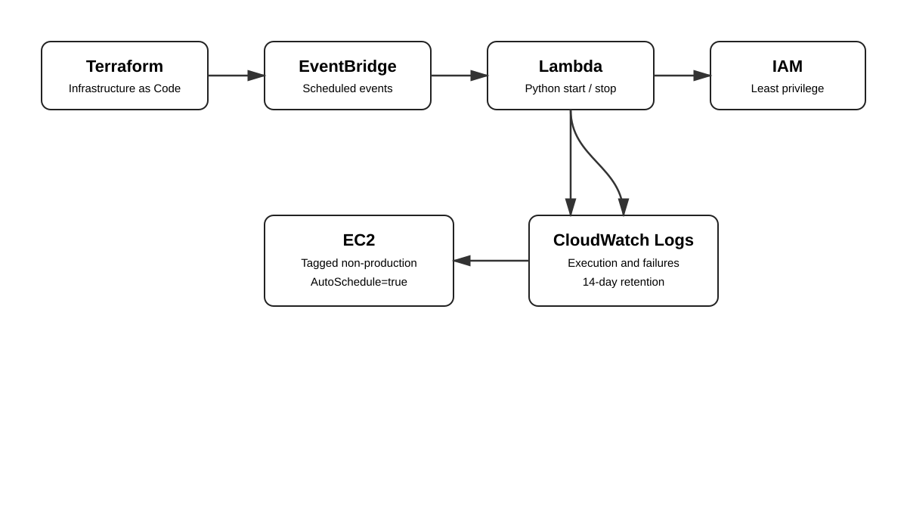

# Serverless Infrastructure Automation on AWS

Terraform-managed, event-driven automation for scheduled EC2 start/stop operations using **AWS Lambda, Python, EventBridge, IAM, CloudWatch, and Terraform**.

## Architecture



```text
Terraform
   |
   +--> IAM role + least-privilege policy
   +--> Lambda start/stop functions
   +--> EventBridge schedules
   +--> CloudWatch log groups
                         |
                         v
                  Tagged EC2 instances
                  AutoSchedule=true
```

## What is implemented

- Terraform provisions the AWS resources instead of relying on manual console configuration.
- Two Python Lambda functions discover EC2 instances by tag and start or stop only matching instances.
- EventBridge provides separate schedules for start and stop operations.
- IAM permissions are scoped to the EC2 operations and CloudWatch logging required by the functions.
- CloudWatch log groups retain execution logs for troubleshooting.
- Terraform packages the Lambda source automatically using the HashiCorp archive provider.
- Terraform variables make schedules, region, environment and tag selection configurable.
- GitHub Actions validates Terraform and Python on every pull request/push.
- No credentials, account IDs, ARNs or hard-coded instance IDs are stored in the repository.

## Repository structure

```text
terraform/                    Infrastructure as Code
lambda/                       Python Lambda functions
tests/                        Python smoke tests
architecture/                 Architecture diagram
docs/                         Deployment, IAM, troubleshooting and cost docs
.github/workflows/            CI validation
```

## EC2 opt-in model

Only instances with the configured tag are eligible:

```text
AutoSchedule=true
```

The start function selects tagged `stopped` instances. The stop function selects tagged `running` instances. This avoids maintaining lists of instance IDs in code.

## Terraform workflow

```bash
cd terraform
terraform init
terraform fmt -check -recursive
terraform validate
terraform plan
terraform apply
```

See [Deployment Guide](docs/deployment.md).

## Security

The Lambda execution role does not use broad `AmazonEC2FullAccess`. EC2 start/stop operations are conditioned on the configured resource tag. EventBridge can invoke only the intended Lambda functions.

Never commit:

- AWS access keys
- AWS secret keys
- session tokens
- service-account files
- local Terraform state
- real `.tfvars` containing sensitive data

## Observability

CloudWatch log groups are created for both Lambda functions with 14-day retention. Logs include the number and IDs of instances selected and the submitted operation.

## Cost optimization

Stopping non-production EC2 instances outside their required operating window can reduce compute runtime. Actual savings depend on instance types, schedules and workload behavior; this project intentionally does not claim an unmeasured percentage reduction.

## Important production considerations

This is a portfolio/lab implementation. Production environments should additionally consider dependency-aware shutdowns, maintenance windows, exclusions for stateful systems, remote Terraform state with locking, deployment identity controls, alerting, and change approval.
